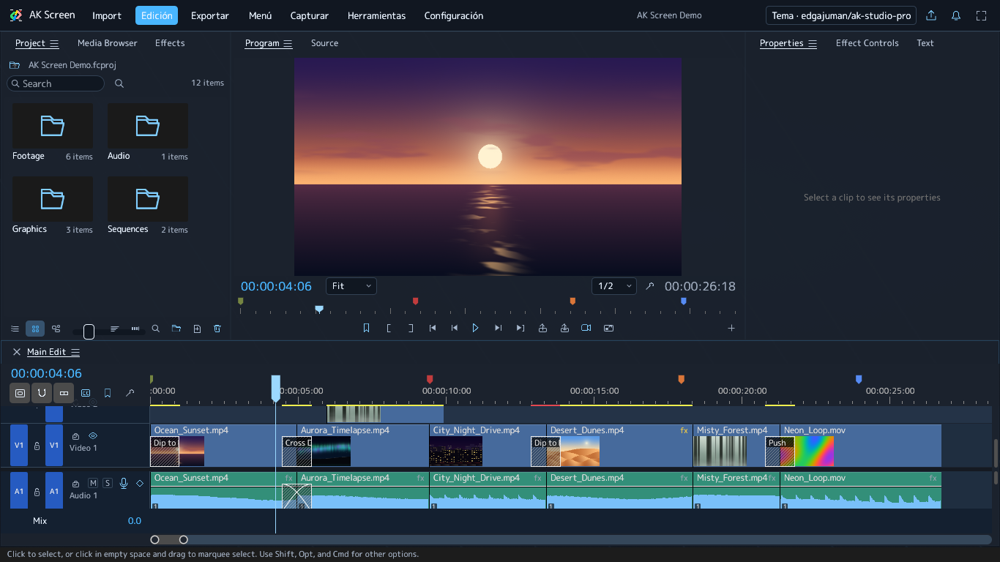
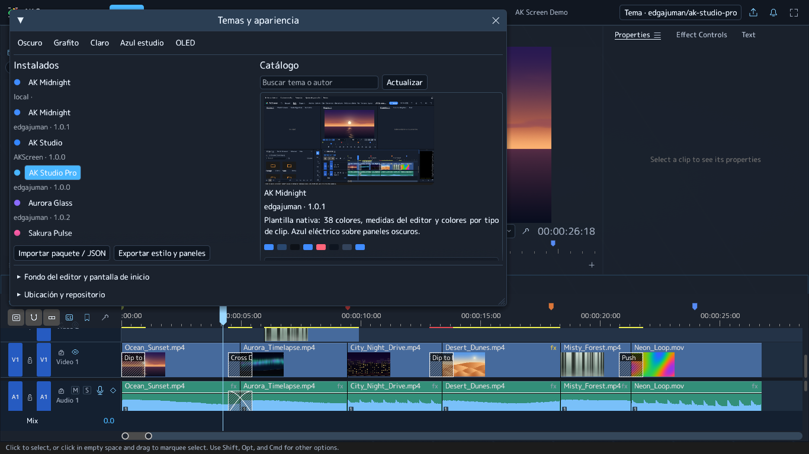
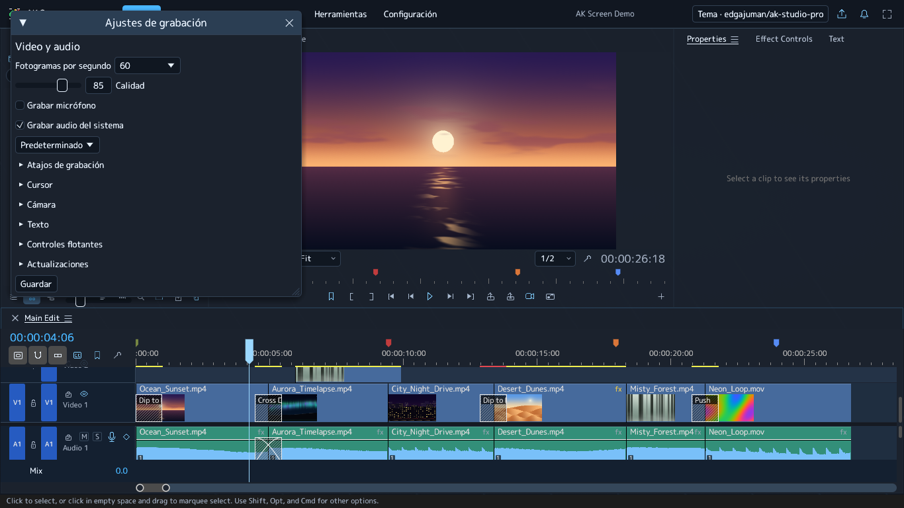

  
  <h1>AK Screen</h1>
  
<strong>Del escritorio a la línea de tiempo.</strong>

  
Graba procesos, ajusta la cámara y convierte tus explicaciones en tutoriales.

  

    <a href="https://github.com/Edgajuman/AKScreen-Downloads/releases"><strong>Descargar</strong></a>
    &nbsp; · &nbsp;
    <a href="docs/PRIMEROS-PASOS.md">Primeros pasos</a>
    &nbsp; · &nbsp;
    <a href="docs/TEMAS.md">Crear un tema</a>
    &nbsp; · &nbsp;
    <a href="https://github.com/Edgajuman/AKScreen-Downloads/releases">Historial de versiones</a>
  

---

## Grabar. Ajustar. Exportar.

AK Screen reúne captura de escritorio y edición multipista. El video, los clics,
el cursor, la cámara y los textos quedan en capas que puedes ajustar después de
grabar. Tus proyectos, capturas y eventos se guardan en tu dispositivo.

> **AK Screen 2.3.0 está disponible** para Windows x64, Linux x64 y macOS (Apple Silicon e Intel). [Instalador de Windows](https://github.com/Edgajuman/AKScreen-Downloads/releases/download/ak-v2.3.0/AKScreen-Windows-x64-Setup.exe) · [Paquete Linux](https://github.com/Edgajuman/AKScreen-Downloads/releases/download/ak-v2.3.0/AKScreen-Linux-x64.tar.gz) · [Descargas para macOS y otros formatos](https://github.com/Edgajuman/AKScreen-Downloads/releases/tag/ak-v2.3.0).

| Captura | Edición | Personalización |
|---|---|---|
| Monitor, escritorio o región | Clips, pistas y fotogramas clave | Marketplace con vistas previas |
| Pausa y controles flotantes | Cursor y clics editables | SVG, fuentes y temas por autor |
| Texto con atajo configurable | Cámara suave y seguimiento de arrastre | Fondos animados y pantalla de inicio |
| Interfaces de Windows en capas de imagen | Títulos, audio, efectos y MP4 | Historial y descargas desde la campana |

[**Explorar el catálogo de temas →**](https://edgajuman.github.io/AK-Screen-Themes/)

[**Explorar extensiones y widgets →**](https://edgajuman.github.io/AK-Screen-Extensions/)

## Extensiones para tu flujo de trabajo

En **Herramientas → Extensiones** instala herramientas del catálogo firmado o
importa un paquete local. Los widgets pueden ocupar el panel de extensiones o
una ventana flotante. La activación muestra los permisos solicitados.

| Extensión de Edgajuman | Uso |
|---|---|
| Notas | Conserva apuntes dentro de tu equipo |
| Checklist de tutorial | Revisa los pasos de una grabación |
| Títulos animados | Aplica entradas a los textos seleccionados |
| Herramientas de cámara | Ajusta la composición por capas |
| Acabado | Aplica ajustes visuales |
| Chat AI | Consulta a OpenAI, OpenRouter, Gemini, Claude o Grok con tus claves |
| WASM Lab | Ejemplo del SDK: contador persistente y efecto de color Warm Grade |

**Chat AI** puede recibir un resumen del proyecto o un fotograma con tu
autorización. Las claves se guardan en el almacén de credenciales del sistema;
el asistente no ejecuta acciones en el editor. Los proveedores requieren
Internet y pueden cobrar por uso.

Puedes instalar varias versiones de una extensión, activar una, actualizarla o
volver a una anterior. Los cambios de versión conservan los datos y crean una
copia. Al desinstalar, puedes elegir **borrar datos** y **borrar claves** por
separado; ambas opciones están desmarcadas inicialmente. El borrado de datos
afecta a todas las versiones de esa extensión y requiere confirmación.

El [repositorio y SDK de extensiones](https://github.com/Edgajuman/AK-Screen-Extensions)
incluye ejemplos y el proceso de fork y pull request. Los componentes WebAssembly
no reciben acceso directo a archivos, procesos ni red: trabajan con permisos y
límites de memoria e instrucciones. La revisión y el mantenimiento siguen siendo
necesarios; el aislamiento no garantiza ausencia de vulnerabilidades.

## El editor en uso

Capturas reales de AK Screen 2.2 con AK Studio Pro y contenido de demostración generado por la aplicación.

| Sakura Pulse | Pantalla de carga personalizada |
|---|---|
|  |  |

El catálogo también está integrado en el editor, con vistas previas y descarga del paquete completo:

## Ejemplos de uso

**Explicar una hoja de cálculo.** Mantén el clic al seleccionar una tabla: la cámara
permanece ampliada y sigue el arrastre. Al soltar, vuelve suavemente al encuadre general.
Prueba 1,6× de zoom, 600 ms de entrada y 800 ms de salida.

**Mostrar un procedimiento.** Activa el cursor simulado para que viaje en línea recta
hacia el siguiente clic y llegue sincronizado. Después desplaza o ajusta los clips
de cámara y clics en la línea de tiempo.

**Añadir una explicación breve.** Activa texto, pulsa Ctrl+K, escribe y vuelve a pulsarlo.
El texto se convierte en un clip editable: cambia fuente, color, fondo, opacidad,
posición y duración. También puedes añadir texto directamente desde el editor.

**Animar una interfaz.** Captura una ventana de Windows e importa los controles
accesibles como imágenes independientes. Escala y anima botones, campos o paneles.
Su texto interno permanece rasterizado; las ventanas sin controles accesibles
se importan como una imagen completa.

[Ver el tutorial de primeros pasos →](docs/PRIMEROS-PASOS.md)

## Composición, motion y subtítulos

En **Herramientas → Animación, capas y efectos…** puedes crear controles de capas,
vincular clips, ajustar anclas, alinear y distribuir, y generar animaciones con
fotogramas editables. La vista previa permite mover, escalar y girar una selección.
Las capas existentes admiten profundidad y rotación X/Y/Z: puedes inclinar una
imagen, un video o un texto hacia dentro y hacia fuera del plano. La cámara
compartida 2D/3D admite fotogramas clave y controles en la vista previa. El
generador de objetos ofrece cubos, esferas, planos, cilindros, pirámides y toros.
Los textos incluyen degradados y animación por caracteres, además de los
controles de fuente, tamaño, espaciado, contorno y fondo.

**Herramientas → Subtítulos automáticos…** transcribe una pista seleccionada o la
secuencia. El modelo se descarga solo con tu consentimiento y se guarda en una
caché compartida entre versiones; después funciona localmente. Revisa el resultado
antes de insertarlo como subtítulos editables o exportarlo a SRT/VTT.

**Configuración** reúne grabación, audio, cursor, preferencias del editor, atajos
y apariencia. Arrastra las pestañas hacia el centro o los bordes para reorganizar
los paneles y guarda tu espacio de trabajo. Los temas permiten cambiar la
superficie, las líneas y la disposición mediante estilos nativos acotados.

La composición transforma planos de capas; no importa modelos OBJ/glTF ni
ofrece sombras entre objetos. Los generadores de geometría son procedurales.
La precisión de los subtítulos depende del modelo y del audio; requiere revisión.

## Descargas

| Sistema | Paquete |
|---|---|
| Windows x64 | Instalador `.exe` y ZIP portable |
| Linux x64 | Archivo `.tar.gz`, Ubuntu 24.04 o compatible |
| macOS Apple Silicon | `.dmg` ARM64 |
| macOS Intel | `.dmg` x64 |

Encuentra cada paquete y sus sumas SHA-256 en [Releases](https://github.com/Edgajuman/AKScreen-Downloads/releases).
Las versiones de Windows usan carpetas independientes y permiten elegir otra ruta.
Conserva una copia del proyecto antes de abrirlo con una versión anterior.

La captura permite elegir entre 15 y 120 FPS, con 60 FPS por defecto. La velocidad efectiva depende del equipo y puede ser menor que la seleccionada. macOS
requiere permisos de grabación de pantalla y accesibilidad. En Linux, el registro
global de acciones requiere X11; la captura en Wayland depende del escritorio.
Los instaladores no tienen certificado comercial y macOS usa firma ad hoc.

## Tu paleta, tu espacio de edición

[**AK Midnight**](https://github.com/Edgajuman/AK-Screen-Themes/tree/main/themes/edgajuman/ak-midnight)
combina fondos azul oscuro, texto claro y acento azul eléctrico. Su plantilla
nativa sirve como punto de partida. [AK Studio Pro](https://github.com/Edgajuman/AK-Screen-Themes/tree/main/themes/edgajuman/ak-studio-pro) amplía el ejemplo a 47 colores, medidas, disposición de paneles, estilos nativos, 24 iconos, fuente local, fondo WebP y carga GIF.

1. Abre **Configuración → Temas y catálogo** y selecciona **AK Midnight**.
2. Usa **Exportar estilo y paneles** para crear tu variante.
3. Cambia el nombre, el identificador y los colores en el JSON e impórtalo.

[Guía de temas y publicación de catálogos →](docs/TEMAS.md)

El catálogo oficial está en [AK-Screen-Themes](https://github.com/Edgajuman/AK-Screen-Themes).
Cada autor añade sus paquetes en `themes/autor/tema/` mediante fork y pull request.
Los temas aceptados aparecen automáticamente en el editor y en el catálogo web,
con vista previa y descarga. Cada PC conserva los paquetes en su propia carpeta
local de temas. El repositorio y esa carpeta pueden cambiarse desde **Temas y
apariencia**. Los paquetes admiten SVG, fuentes y fondos; no ejecutan código.

## Versiones y código

La campana de AK Screen muestra cambios y descargas. El catálogo estático
[versions.json](versions.json) se consulta por HTTPS desde GitHub; puedes desactivar
la búsqueda de novedades. Los instaladores se verifican mediante SHA-256 antes
de ofrecer su apertura. Desde 2.2, el historial marca las instalaciones locales,
muestra sus rutas y permite abrir el desinstalador de cada versión de Windows.
La versión en uso requiere guardar y cerrar antes de retirarla. Las copias
portables se administran desde su carpeta. El administrador reconoce instalaciones antiguas; para usar estos controles, abre AK Screen 2.2 o posterior. No se necesita una cuenta para usar la aplicación.

Desde 2.3, la campana también muestra anuncios firmados, guías y contenido con
Markdown, imágenes, GIF y videos. El visor de videos de los avisos reproduce
sin audio. Puedes consultar después el contenido ya descargado sin conexión.
Los paquetes de contenido no reemplazan los ejecutables del editor.

Si hay cambios al cerrar un proyecto, AK Screen ofrece **Guardar**, **No guardar**
o **Cancelar**. Elegir No guardar descarta también su recuperación pendiente.

Este repositorio publica instaladores, temas, guías y metadatos. El código fuente
se administra en un repositorio privado. La infraestructura pública de compilación
recibe archivos de fuente cifrados y cifra sus diagnósticos y cachés. Solo los
paquetes de distribución se publican para descargar.

## Créditos

Créditos a [**FilmCraft**](https://github.com/storytold/filmcraft), a sus autores
y colaboradores por su trabajo en edición de video con Rust. El código se utiliza
bajo sus licencias MIT / Apache-2.0. Los avisos de licencia, copyright y atribución
acompañan a cada paquete distribuido.

El icono de AK Screen se usa con autorización del propietario de la aplicación.
Las fuentes Inter, Noto Serif y JetBrains Mono conservan sus licencias SIL OFL 1.1.
