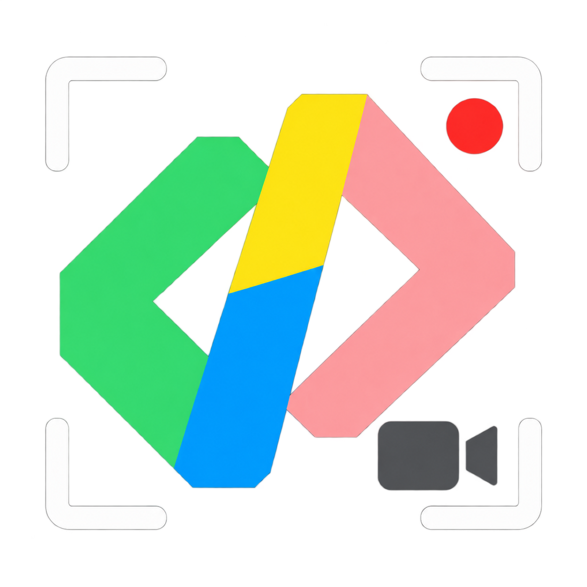
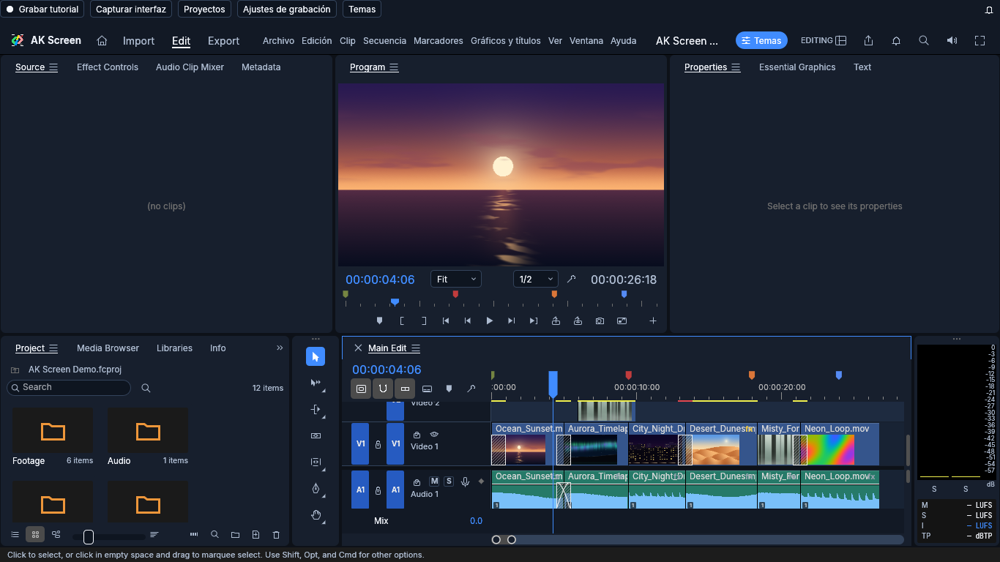
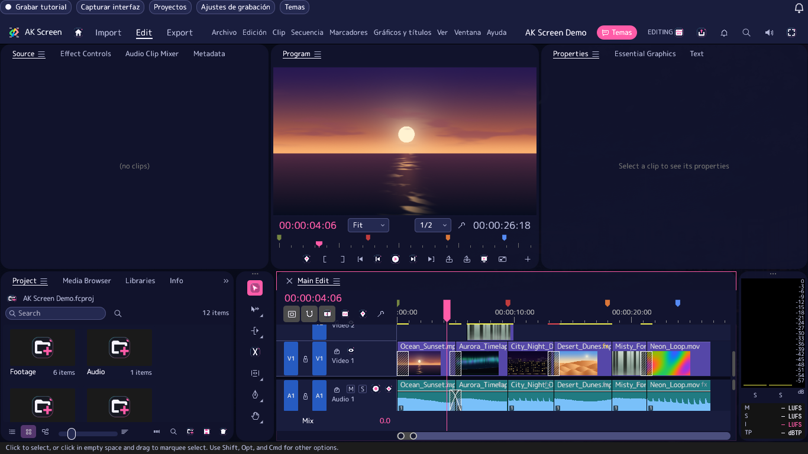
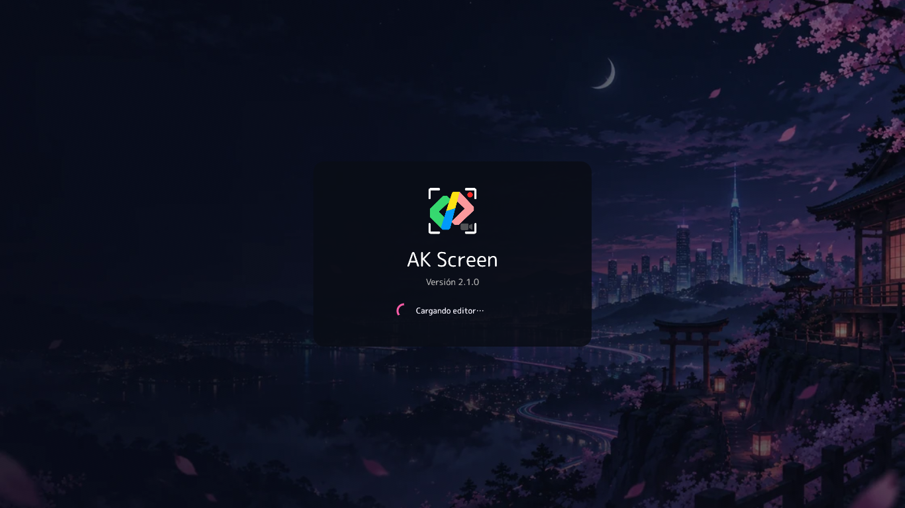
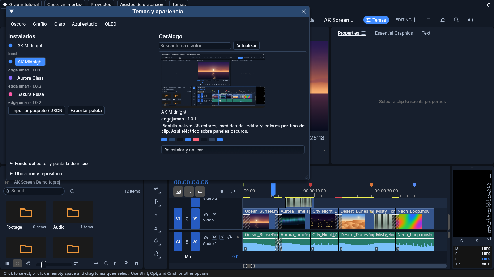
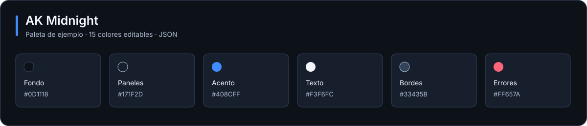

  
  <h1>AK Screen</h1>
  
<strong>Del escritorio a la línea de tiempo.</strong>

  
Graba procesos, ajusta la cámara y convierte tus explicaciones en tutoriales.

  

    <a href="https://github.com/Edgajuman/AKScreen-Downloads/releases"><strong>Descargar</strong></a>
    &nbsp; · &nbsp;
    <a href="docs/PRIMEROS-PASOS.md">Primeros pasos</a>
    &nbsp; · &nbsp;
    <a href="docs/TEMAS.md">Crear un tema</a>
    &nbsp; · &nbsp;
    <a href="https://github.com/Edgajuman/AKScreen-Downloads/releases">Historial de versiones</a>
  

---

## Grabar. Ajustar. Exportar.

AK Screen reúne captura de escritorio y edición multipista. El video, los clics,
el cursor, la cámara y los textos quedan en capas que puedes ajustar después de
grabar. Tus proyectos, capturas y eventos se guardan en tu dispositivo.

> **Estado de distribución:** la versión 2.1 está en validación. La release 2.0
> es una vista previa histórica del editor; todavía no integra la grabación de tutoriales.

| Captura | Edición | Personalización |
|---|---|---|
| Monitor, escritorio o región | Clips, pistas y fotogramas clave | Marketplace con vistas previas |
| Pausa y controles flotantes | Cursor y clics editables | SVG, fuentes y temas por autor |
| Texto con atajo configurable | Cámara suave y seguimiento de arrastre | Fondos animados y pantalla de inicio |
| Interfaces de Windows en capas de imagen | Títulos, audio, efectos y MP4 | Historial y descargas desde la campana |

[**Explorar el catálogo de temas →**](https://edgajuman.github.io/AK-Screen-Themes/)

## El editor en uso

Capturas reales de AK Screen 2.1 con contenido de demostración generado por la aplicación.

| Sakura Pulse | Pantalla de carga personalizada |
|---|---|
|  |  |

El catálogo también está integrado en el editor, con vistas previas y descarga del paquete completo:

## Ejemplos de uso

**Explicar una hoja de cálculo.** Mantén el clic al seleccionar una tabla: la cámara
permanece ampliada y sigue el arrastre. Al soltar, vuelve suavemente al encuadre general.
Prueba 1,6× de zoom, 600 ms de entrada y 800 ms de salida.

**Mostrar un procedimiento.** Activa el cursor simulado para que viaje en línea recta
hacia el siguiente clic y llegue sincronizado. Después desplaza o ajusta los clips
de cámara y clics en la línea de tiempo.

**Añadir una explicación breve.** Activa texto, pulsa Ctrl+K, escribe y vuelve a pulsarlo.
El texto se convierte en un clip editable: cambia fuente, color, fondo, opacidad,
posición y duración. También puedes añadir texto directamente desde el editor.

**Animar una interfaz.** Captura una ventana de Windows e importa los controles
accesibles como imágenes independientes. Escala y anima botones, campos o paneles.
Su texto interno permanece rasterizado; las ventanas sin controles accesibles
se importan como una imagen completa.

[Ver el tutorial de primeros pasos →](docs/PRIMEROS-PASOS.md)

## Descargas

| Sistema | Paquete |
|---|---|
| Windows x64 | Instalador `.exe` y ZIP portable |
| Linux x64 | Archivo `.tar.gz`, Ubuntu 24.04 o compatible |
| macOS Apple Silicon | `.dmg` ARM64 |
| macOS Intel | `.dmg` x64 |

Encuentra cada paquete y sus sumas SHA-256 en [Releases](https://github.com/Edgajuman/AKScreen-Downloads/releases).
Las versiones de Windows usan carpetas independientes y permiten elegir otra ruta.
Conserva una copia del proyecto antes de abrirlo con una versión anterior.

La captura tiene un objetivo de 30 FPS, sujeto al rendimiento del equipo. macOS
requiere permisos de grabación de pantalla y accesibilidad. En Linux, el registro
global de acciones requiere X11; la captura en Wayland depende del escritorio.
Los instaladores no tienen certificado comercial y macOS usa firma ad hoc.

## Tu paleta, tu espacio de edición

[**AK Midnight**](https://github.com/Edgajuman/AK-Screen-Themes/tree/main/themes/edgajuman/ak-midnight)
combina fondos azul oscuro, texto claro y acento azul eléctrico. Su plantilla
nativa enumera los 38 colores del editor, medidas y colores por tipo de clip.

1. Abre **Temas** y selecciona **AK Midnight**.
2. Usa **Exportar paleta** para crear tu variante.
3. Cambia el nombre, el identificador y los colores en el JSON e impórtalo.

[Guía de temas y publicación de catálogos →](docs/TEMAS.md)

El catálogo oficial está en [AK-Screen-Themes](https://github.com/Edgajuman/AK-Screen-Themes).
Cada autor añade sus paquetes en `themes/autor/tema/` mediante fork y pull request.
Los temas aceptados aparecen automáticamente en el editor y en el catálogo web,
con vista previa y descarga. Cada PC conserva los paquetes en su propia carpeta
local de temas. El repositorio y esa carpeta pueden cambiarse desde **Temas y
apariencia**. Los paquetes admiten SVG, fuentes y fondos; no ejecutan código.

## Versiones y código

La campana de AK Screen muestra cambios y descargas. El catálogo estático
[versions.json](versions.json) se consulta por HTTPS desde GitHub; puedes desactivar
la búsqueda de novedades. Los instaladores se verifican mediante SHA-256 antes
de ofrecer su apertura. No se necesita una cuenta para usar la aplicación.

Este repositorio publica instaladores, temas, guías y metadatos. El código fuente
se administra en un repositorio privado. Las compilaciones leen la fuente con
una clave de solo lectura en máquinas temporales y cifran sus diagnósticos para
el propietario. No se publican fuentes ni cachés de compilación.

## Créditos

Créditos a [**FilmCraft**](https://github.com/storytold/filmcraft), a sus autores
y colaboradores por su trabajo en edición de video con Rust. El código se utiliza
bajo sus licencias MIT / Apache-2.0. Los avisos de licencia, copyright y atribución
acompañan a cada paquete distribuido.

El icono de AK Screen se usa con autorización del propietario de la aplicación.
Las fuentes Inter, Noto Serif y JetBrains Mono conservan sus licencias SIL OFL 1.1.
